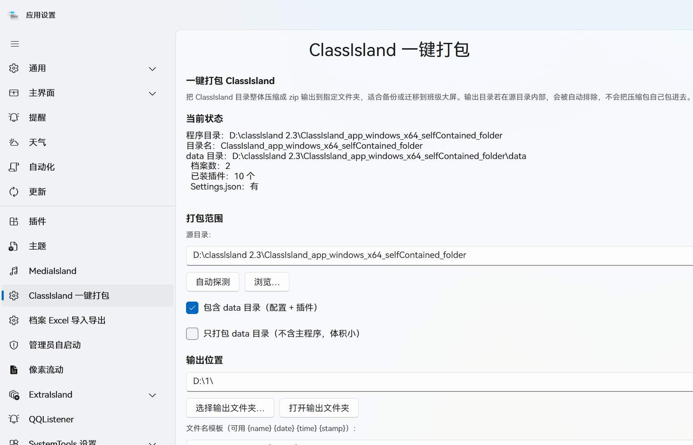

# ClassIsland.AutoPacker · 一键打包

把整个 **ClassIsland** 程序目录（含 `data` 里的配置与插件）一键打包成 zip，
输出到指定文件夹。用来做备份，或者把配好的环境整个搬到另一台机器 / 教室大屏上。

> ~~我説我很懶有沒有懂得（~~



---

## 和原版备份的区别

ClassIsland 本身**有**自动备份功能（设置里可以配置间隔、上限，也能手动备份），
但它备份的是**应用数据**——档案、配置这些，存到应用自己的备份目录里。

本插件做的是**另一件事**：把**整个 ClassIsland 程序目录**（含主程序本体、`data` 里的配置与插件）
打包成一个可以随便拷走的 zip。

| | 原版自动备份 | 本插件 |
| --- | --- | --- |
| 备份内容 | 档案、配置等应用数据 | **整个程序目录**（主程序 + data + 插件） |
| 存放位置 | 应用自己的备份目录 | 你指定的任意文件夹 |
| 用途 | 出问题时回滚数据 | **整个环境搬到另一台机器 / 教室大屏** |
| 能否直接解压就用 | ❌ 需要重新装一份 ClassIsland | ✅ 解压出来就是一份能跑的完整环境 |

简单说：原版备份是「**保命**」，本插件是「**搬家**」。

---

## 功能

- **一键打包**：点一下就把 ClassIsland 装好配置的整个目录压成一个 zip。
- **自动探测程序目录**：插件能自己找到 ClassIsland 根目录，也可以手动指定。
- **打包范围可选**：
  - 默认打包整个程序目录（主程序 + `data`）；
  - 也可以只打 `data`（只有配置和插件，体积小，迁移够用）；
  - 或者排除 `data`，只打主程序。
- **文件名模板**：支持 `{name}` `{date}` `{time}` `{stamp}` `{version}` 占位符。
- **压缩级别**：最快 / 较快 / 标准 / 最大压缩。
- **排除规则**：通配符（`*` 与 `?`）匹配文件名或相对路径，可自己增删。
- **打包后校验**：重新打开 zip 核对条目数。
- **自动清理旧备份**：只保留最近 N 份。
- **实时进度与日志**：扫描 / 压缩 / 校验各阶段都有进度，日志可一键清空。

---

## 安装

1. 下载 Release 里的压缩包（或自行编译）。
2. 解压到 `<ClassIsland 程序目录>\data\Plugins\classisland.autopacker\`。
   目录里应当能看到 `manifest.yml`、`ClassIsland.AutoPacker.dll`、`icon.png`。
3. 重启 ClassIsland。

## 使用

打开 **设置 → 外部 → ClassIsland 一键打包**：

1. **源目录**：留空则自动探测，也可以点「自动探测」或「浏览…」手动指定。
2. **输出目录**：必填，zip 就放在这里。
3. **文件名模板**：例如 `ClassIsland备份_{stamp}` 会生成 `ClassIsland备份_20260926_224444.zip`。
4. 按需调整范围、压缩级别、排除规则、保留份数。
5. 点 **「📦 立即打包」**，进度和日志会实时刷出来。
6. 点「保存设置」记下当前配置，下次开箱即用。

---

## 几个坑（已经替你踩了）

- **输出目录在源目录里面会滚雪球。**
  如果 zip 输出到被打包的目录内部，那这个 zip 自己也会被下一次打包收进去，
  反复打包会得到层层嵌套的巨型文件。插件用规范化全路径前缀比较把输出目录整体排除掉。

- **目标 zip 和它的 `.tmp` 临时文件永远排除。**

- **文件被占用不整体失败。**
  ClassIsland 运行时可能正占着日志文件，这时跳过该文件并记一条警告，其余照打不误。

- **同名不覆盖。**
  输出目录里已有同名 zip 时自动加 `(1)`、`(2)` 序号，绝不悄悄盖掉主人的旧备份。

- **原子替换。**
  先写 `.tmp`，写完再 Move 成正式文件名 —— 中途失败不会留下半个坏包。

- **写文件时用 `FileShare.ReadWrite` 打开源文件**，尽量少干扰正在运行的 ClassIsland。

---

## 从源码编译

```powershell
git clone https://github.com/pioneer66679/classisland.autopacker.git
cd ClassIsland.AutoPacker
dotnet build -c Release
```

产物在 `bin\Release\`，把 `manifest.yml`、`ClassIsland.AutoPacker.dll`、`icon.png`
丢进 `data\Plugins\classisland.autopacker\` 即可。

### 依赖

- .NET 8.0
- [`ClassIsland.PluginSdk`](https://www.nuget.org/packages/ClassIsland.PluginSdk) 2.0.1（`PrivateAssets=all`，不打进产物）

打包本身只用 `System.IO.Compression`，没有额外的第三方依赖。

---

## 许可

[GNU General Public License v3.0](LICENSE) © 2026 aaa人機課長

你可以自由使用、修改、分发本插件，但**衍生作品必须以同样的 GPL-3.0 协议开源**。

> 这个选择与 ClassIsland 本体保持一致 —— ClassIsland 从 1.6 起改用 GPLv3
> （见 [Discussion #697](https://github.com/ClassIsland/ClassIsland/discussions/697)）。

### 关于依赖

- [ClassIsland.PluginSdk](https://www.nuget.org/packages/ClassIsland.PluginSdk)：`LGPL-3.0-only`。
  本插件以 `PrivateAssets=all` + `ExcludeAssets="runtime"` 引用，**不随插件分发 SDK 程序集**。
- 打包功能只用 .NET 内置的 `System.IO.Compression`，无第三方依赖。

### 历史版本

v1.0.1 及更早的版本以 **MIT** 许可发布。已发布的许可不可撤销，
拿到旧版的人仍可继续按 MIT 使用那些版本。
